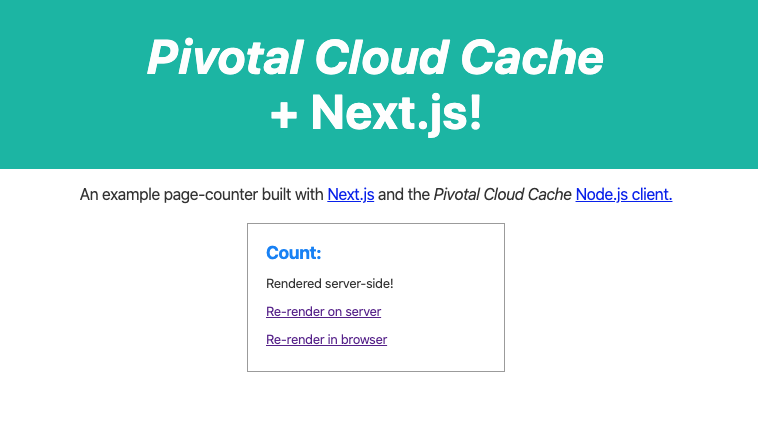

# Page Counting Node.js Client App

This example demonstrates use of the Node.js client with a simple Next.js web app. 

The rendered site displays a count of page renderings,
backed either by a local Pivotal GemFire cluster or
by a Pivotal Cloud Cache (PCC) service instance.
This app has been tested with PCC version 1.8.1.

## Prerequisites

- **Node.js**, minimum version of 10.16.3

- **npm**, the Node.js package manager

- **Examples source code**.  Acquire the repository:

    ```
    $ git clone git@github.com:gemfire/node-examples.git
    ```

- **Node.js client library**. Acquire the Node.js client library from PivNet under [Cloud Cache](https://network.pivotal.io/products/p-cloudcache/).
The file is a compressed tar archive (suffix `.tgz`), and the filename contains the client library version number.
For example:
`gemfire-nodejs-client-2.0.0.tgz`.


- **Pivotal GemFire**.
Acquire Pivotal GemFire from PivNet at [Pivotal GemFire](https://network.pivotal.io/products/pivotal-gemfire/). Be sure to install GemFire's prerequisite Java JDK 1.8.X, which is needed to support gfsh, the GemFire command line interface.
Choose your GemFire version based on the version of Cloud Cache in your PAS environment.
See the [Product Snapshot](https://docs.pivotal.io/p-cloud-cache/product-snapshot.html) for your Cloud Cache version.

- **Configure environment variables**.
Set `GEODE_HOME` to the GemFire installation directory and add `$GEODE_HOME/bin` to your `PATH`. For example

    On Mac and Linux:

    ```bash
    export GEODE_HOME=/Users/MyGemFire
    export PATH=$GEODE_HOME/bin:$PATH
    ```

    On Windows (standard command prompt):
  
    ```cmd
    set GEODE_HOME=c:\Users\MyGemFire
    set PATH=%GEODE_HOME%\bin;%PATH%
    ```

  *Note:* If you ran the book-service example in a local development
environment prior to running this example,
make sure to unset the book-service's `VCAP_SERVICES` environment variable.
If it is set, this example will fail to run.

## Install the Node.js Client Module

With a current working directory of `node-examples/book-service`,
install the Node.js client module:

```bash
$ npm install gemfire-nodejs-client-2.0.0.tgz
$ npm update
```

At this point, you can choose to *Run the Example Locally* or *Run the Example with Cloud Cache as the Data Service*.

## Run the Example Locally

To run the example locally,

1. Start a server cluster in a command shell.
2. Start the client in a second command shell.
3. View the app in a browser window.

### Start a Cluster

In a command shell, with your current working directory set to `node-examples/nextjs-page-counter`, start  gfsh and create a GemFire cluster with a single locator and a single server:

```
$ gfsh
gfsh>start locator
gfsh>start server
gfsh>create region --name=example_partition_region --type=PARTITION
```

The locator provides administration services for the cluster and a discovery service allowing clients and servers to find each other. The server provides storage for data along with computation services.

The application uses the region `example_partition_region` to store data in the server (similar to a table in relational databases). A region is similar to a hashmap and stores all data as key/value pairs.

There is no need to exit gfsh at this time -- simply leave it running at the `gfsh>` prompt and open a new shell for the client app.

### Run the Example App

1. Leave the server window active with the gfsh task running, and open a separate shell for the client.

1. Set your current working directory to `node-examples/nextjs-page-counter`,
 and run the app: 

    ```
    $ npm run dev
    ```

1. The Next.js app renders a page in the web server posts it at `http://localhost:3000`.
Open a browser and view the page at that address.


 
See [Next.js Server-Side Rendering](https://nextjs.org/features/server-side-rendering) for more information on the rendering.

  - The initial page displays an empty count, `Count: `
  - Clicking on `Re-render in browser` displays `Count: N/A`. An express api could be created to support user-side requests.
  - Clicking on `Re-render on server` displays `Count: 1`. This is the updated count that is stored in the GemFire cluster.

### Clean Up the Local Development Environment

When finished running the example locally, shut down the client and server processes:

1. In the shell running `npm run dev`, type `control-C` to stop the client app.

1. In the shell
running gfsh, use the gfsh `shutdown` command to tear down the cluster.
Answer 'Y' when prompted for confirmation:

    ```
    gfsh>shutdown --include-locators=true
    As a lot of data in memory will be lost, including possibly events in queues, do you really want
    to shutdown the entire distributed system? (Y/n): Y
    Shutdown is triggered

    gfsh>exit
    ```

## Run the Example with Cloud Cache as the Data Service

This section uses the following names - if your Cloud Cache instance uses different names, substitute as appropriate for these:

- **service-name**: PCC-TLS
- **service-key**: PCC-TLS-service-key
- **PAS-name**: ultramarineblue
- **app-name**: cloudcache-node-sample

### Create and Configure a Cloud Cache Service Instance

1. Use the cf CLI to log in and target your org and space.

2. Create a Cloud Cache service instance
that disables TLS encryption.
Complete directions are available at [Create or Delete a Service Instance](https://docs.pivotal.io/p-cloud-cache/create-instance.html).

    On Mac and Linux:

    ```
    $ cf create-service p-cloudcache dev-plan PCC-TLS  -c '{"tls": true}'
    ```

    On Windows (standard command prompt) you must escape the inner quotes:

    ```
    $ cf create-service p-cloudcache dev-plan PCC-TLS  -c "{\"tls\": true}"
    ```

3. Edit the file `pages/index.js` to un-comment the two lines that enable ssl on the client:

    ```
    /*                                                                                                                                                                                   
    * Un-comment the two following lines if running against a PCC instance with TLS enabled                                                                                              
    */                                                                                                                                                                                
    cacheFactory.set('ssl-truststore', '/etc/ssl/certs/ca-certificates.crt')                                                                                                           
    cacheFactory.set('ssl-enabled', 'true')                                                                                                                                            
    ```
    
    Save the changes and exit your editor.

### Build and Push the App

1. View the `manifest.yml` file to verify that the service instance matches the one specified in
the `cf create-service` command above.  If you have been following these instructions,
it is `PCC-TLS`. Edit manifest.yml, if necessary, to make sure it specifies the
service instance you created.

```
  services:
   - PCC-TLS
```

1. With a current working directory of `node-examples/nextjs-page-counter`,
build and push the app and make note of the route assigned for the app:    

    ```
    $ npm run build
    $ cf push

    Pushing from manifest to org my-org / space my-space as admin...
    ...
    Getting app info...
    Creating app with these attributes...
    ...
    Creating app nextjs-page-counter...
    Mapping routes...
    Binding services...
    Comparing local files to remote cache...
    Packaging files to upload...
    Uploading files...
    ...
    Waiting for app to start...

    name:              nextjs-page-counter
    requested state:   started
    routes:            nextjs-page-counter.apps.ultramarineblue.cf-app.com
    ...
         state     since                  cpu    memory          disk          details
    #0   running   2020-02-04T20:18:31Z   0.0%   33.9K of 512M   13.7M of 1G   
    ```

1. View the page served at the route returned from the `cf push` command. (Depending on your system, you may have to specify an `https://` prefix.)
The browser should display the example site:

### Clean Up the Cloud Cache Environment

When done running the app, tear down the app and the Cloud Cache service instance:

1. Stop the running app:

    ```
    $ cf stop nextjs-page-counter
    ```

1. Delete the app and its route:

    ```
     $ cf delete nextjs-page-counter -r -f
    ```
    
1. If the Cloud Cache service instance is no longer needed, delete the service:

    ```
    $ cf delete-service PCC-TLS

    Really delete the service PCC-TLS?> y
    Deleting service PCC-TLS in org test_org / space test_space as admin...
    OK

    Delete in progress. Use 'cf services' or 'cf service PCC-TLS' to check operation status.
    ```
